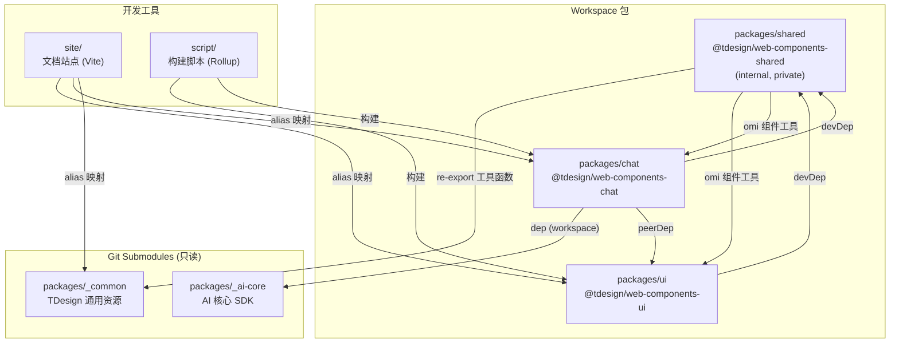

## 用户需求

对 `tdesign-web-components` monorepo 重构分支进行全面 review，涵盖三个维度：

## 核心 Review 项

### 1. 重复代码分析

- `packages/shared/src/_util/helper.ts` 与 `packages/_common/js/utils/helper.ts` 存在 5+ 个重复函数（`omit`, `removeEmptyAttrs`, `getTabElementByValue`, `firstUpperCase`, `getBackgroundColor`, `pxCompat`）
- `packages/shared/src/_util/linearGradient.ts` 与 `helper.ts` 内部重复实现了 `getBackgroundColor` 及相关类型
- `packages/chat/` 使用 `lodash-es` 但未在 `package.json` 中声明（幽灵依赖）
- `packages/ui/package.json` 中 `clsx`、`tailwind-merge`、`immer` 为冗余依赖声明

### 2. 代码引用路径统一

- 53 个 `_example/` 文件仍使用旧别名 `tdesign-web-components` / `tdesign-web-components-chat`
- 15 个 chat 包内文件使用 `../../` 相对路径跨组件引用
- 7 个 ui 包 `_example/` 文件使用 `../../` 相对路径
- `site/sidebar.config.ts` 使用旧路径导入组件文档
- `site/vite.config.ts` 中 `@` alias 与 `tsconfig.json` 不一致

### 3. 架构与工具链修复

- `script/generate-entry.js` 路径指向不存在的根 `src` 目录
- `tailwind.config.js` content 路径未覆盖 packages 目录
- `script/plugin-tdoc/md-to-wc.mjs` 设计文档路径错误
- `.github/workflows/pkg-pr-new.yml` 使用 npm 而非 pnpm
- 遗留废弃文件：`script/rollup.config.js`、`tsconfig.build.json`
- `.eslintrc.cjs`、`.eslintignore` 规则未适配 monorepo
- GitHub Actions workflows 不适配多包发布模式

## 技术栈

- 框架：Omi（Web Components）
- 包管理：pnpm 10.33.0 monorepo + git submodule
- 构建：Rollup（共享工厂配置 `script/rollup.base.mjs`）+ Vite（站点）
- 语言：TypeScript 5.8 + Less
- Lint：ESLint 8 + Prettier + commitlint + husky

## 实施方案

### 1. 重复代码消除策略

**1.1 `shared/_util/helper.ts` 与 `_common` 的重复**

`_common` 是 TDesign 跨框架共享的 submodule，不可修改。`shared` 包是本项目的内部工具库。策略：将 `shared/helper.ts` 中与 `_common` 重复的函数改为从 `@common/js/utils/helper` re-export，仅保留 `shared` 独有的 `getPropsApiByEvent`。

```typescript
// packages/shared/src/_util/helper.ts（修改后）
import { camelCase } from 'lodash-es';
// Re-export from @common to avoid duplication
export {
  omit,
  removeEmptyAttrs,
  getTabElementByValue,
  firstUpperCase,
  getBackgroundColor,
  pxCompat,
} from '@common/js/utils/helper';
export type { Gradients, FromTo, LinearGradient } from '@common/js/utils/helper';

// shared-only utility
export function getPropsApiByEvent(eventName: string) {
  return camelCase(`on-${eventName}`);
}
```

**1.2 `linearGradient.ts` 包内重复消除**

删除 `linearGradient.ts` 文件，统一从 `helper.ts` 导出 `getBackgroundColor` 及相关类型。更新 `shared/src/index.ts` 移除对 `linearGradient` 的 re-export。

**1.3 chat 包幽灵依赖修复**

在 `packages/chat/package.json` 的 `dependencies` 中补充 `"lodash-es": "^4.17.21"`，并在 `devDependencies` 中补充 `"@types/lodash-es": "^4.17.12"`。

**1.4 ui 包冗余依赖清理**

从 `packages/ui/package.json` 的 `dependencies` 中移除：

- `clsx`（仅通过 `@tdesign/web-components-shared` 间接使用）
- `tailwind-merge`（同上）
- `immer`（仅在 `_ai-core/chat-engine` 中使用，chat 包已声明）

注意：`class-variance-authority` 保留，需确认 ui 包内是否有直接使用。

### 2. 导入路径统一策略

**2.1 `_example/` 文件旧别名批量替换**

在 `packages/ui/src/` 目录下批量替换：

- `'tdesign-web-components/` → `'@tdesign/web-components-ui/`
- `'tdesign-web-components'` → `'@tdesign/web-components-ui'`

在 `packages/chat/src/` 目录下批量替换：

- `'tdesign-web-components-chat/` → `'@tdesign/web-components-chat/`

**2.2 chat 包内 `../../` 相对路径改为包别名**

将 `from '../../chat-engine'` 改为 `from '@tdesign/web-components-chat/chat-engine'`，以此类推处理 `../../filecard`、`../../chatbot` 等。chat 包的 `tsconfig.json` 已配置了 `@tdesign/web-components-chat` → `src` 的映射，所以包内引用可以使用此别名。

**2.3 ui 包 `_example/` 中相对路径修复**

将 `from '../../message'` 改为 `from '@tdesign/web-components-ui/message'`。

**2.4 `site/vite.config.ts` 的 `@` alias 修复**

将 `'@': resolve('../')` 改为 `'@': resolve('../packages/ui/src/')`，与 tsconfig 保持一致。同时检查 `site/` 中使用 `@/` 导入的文件（`site/pages/layout/component-layout.tsx` 的 `import packageJson from '@/package.json'`），将其改为相对路径导入或创建专用别名。

### 3. 架构与工具链修复策略

**3.1 `script/generate-entry.js` 路径修复**

将 `path.resolve(__dirname, '../src')` 改为 `path.resolve(__dirname, '../packages/ui/src')`。

**3.2 `tailwind.config.js` content 路径修复**

```js
content: [
  './index.html',
  './packages/*/src/**/*.{js,ts,jsx,tsx}',
  './site/**/*.{js,ts,jsx,tsx}',
],
```

**3.3 `script/plugin-tdoc/md-to-wc.mjs` 路径修复**

第 238 行：`../../src/_common/docs/web/design/` → `../../packages/_common/docs/web/design/`

**3.4 `.github/workflows/pkg-pr-new.yml` 修复**

- 添加 `pnpm/action-setup` 步骤
- `npm install` → `pnpm install`
- `npm run build` → `pnpm run build`

**3.5 清理废弃文件**

- 删除 `script/rollup.config.js`
- 删除 `tsconfig.build.json`

**3.6 `.eslintrc.cjs` 更新**

更新 `no-restricted-imports` 规则，同时限制新旧包名在正式源码中的使用：

```js
patterns: [
  'tdesign-web-components/*',
  '@tdesign/web-components-ui/*',  // 防止 ui 包内部用绝对路径引用自身
],
```

**3.7 `.eslintignore` 补充**

添加 `packages/_ai-core` 忽略条目。

**3.8 根 `tsconfig.json` 的 `@common/*` 路径验证**

当前映射 `"@common/*": ["_common/*"]`，baseUrl 为 `./`（根目录），但 `_common` 实际在 `packages/_common`。需要修正为 `"@common/*": ["packages/_common/*"]`。

## 实施注意事项

- `_common` 和 `_ai-core` 是 git submodule，不可修改其内部文件
- 所有路径替换需保证 Vite 开发服务器、Rollup 构建、TypeScript 类型检查三者一致
- `_example/` 目录在构建时被排除（`!src/**/_example/**`），旧路径在开发模式下通过 Vite alias 兼容工作，但长期应统一
- 依赖变更后需重新运行 `pnpm install` 确认 lockfile 更新

## 架构设计



## 目录结构（涉及修改的文件）

```
tdesign-web-components/
├── .eslintrc.cjs                          # [MODIFY] 更新 no-restricted-imports 规则
├── .eslintignore                          # [MODIFY] 添加 packages/_ai-core
├── tailwind.config.js                     # [MODIFY] 修复 content 路径
├── tsconfig.json                          # [MODIFY] 修正 @common/* 路径映射
├── tsconfig.build.json                    # [DELETE] 废弃遗留文件
├── script/
│   ├── generate-entry.js                  # [MODIFY] 修复路径到 packages/ui/src
│   ├── rollup.config.js                   # [DELETE] 废弃旧版配置
│   └── plugin-tdoc/
│       └── md-to-wc.mjs                   # [MODIFY] 修复设计文档路径
├── site/
│   └── vite.config.ts                     # [MODIFY] 修复 @ alias
├── .github/workflows/
│   └── pkg-pr-new.yml                     # [MODIFY] npm -> pnpm
├── packages/
│   ├── shared/src/
│   │   ├── _util/helper.ts                # [MODIFY] 改为 re-export @common
│   │   ├── _util/linearGradient.ts        # [DELETE] 消除包内重复
│   │   └── index.ts                       # [MODIFY] 移除 linearGradient 导出
│   ├── chat/
│   │   └── package.json                   # [MODIFY] 补充 lodash-es 依赖
│   ├── ui/
│   │   └── package.json                   # [MODIFY] 移除冗余依赖
│   ├── ui/src/**/_example/*.tsx            # [MODIFY] 批量替换旧路径别名 (44 files)
│   └── chat/src/**/*.tsx                   # [MODIFY] 替换旧路径和相对路径 (24 files)
```

## Agent Extensions

### SubAgent

- **code-explorer**
- Purpose: 在执行批量路径替换前，精确定位所有需要修改的文件和行号，避免遗漏或误改
- Expected outcome: 生成完整的文件-行号清单，确保替换覆盖率 100%