# TravelAgentComplete 完整事件交互流程图

## 系统架构概览

```
┌─────────────────┐    HTTP/SSE    ┌─────────────────┐    Event Stream    ┌─────────────────┐
│   前端应用      │ ◄────────────► │   SSE服务器     │ ◄────────────► │  TravelAgent    │
│  (React/Vue)    │                │  (ssemock.js)   │                │  Complete       │
└─────────────────┘                └─────────────────┘                └─────────────────┘
         │                                   │                                   │
         │                                   │                                   │
         ▼                                   ▼                                   ▼
┌─────────────────┐                ┌─────────────────┐                ┌─────────────────┐
│   用户界面      │                │   事件收集器    │                │   底层模型      │
│   状态管理      │                │   状态存储      │                │   工具调用      │
│   事件处理      │                │   错误处理      │                │   业务逻辑      │
└─────────────────┘                └─────────────────┘                └─────────────────┘
```

## 详细事件交互流程

### 1. 初始化阶段

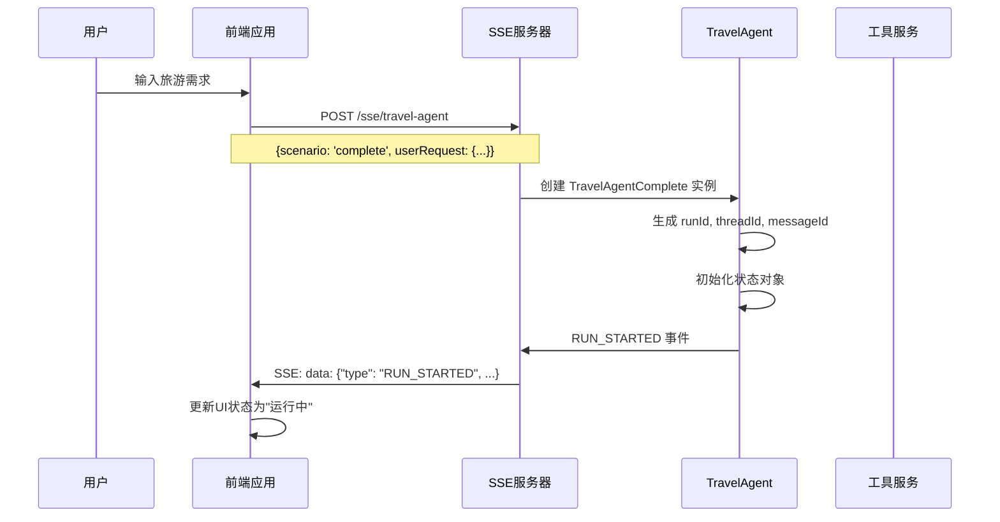

### 2. 需求分析阶段

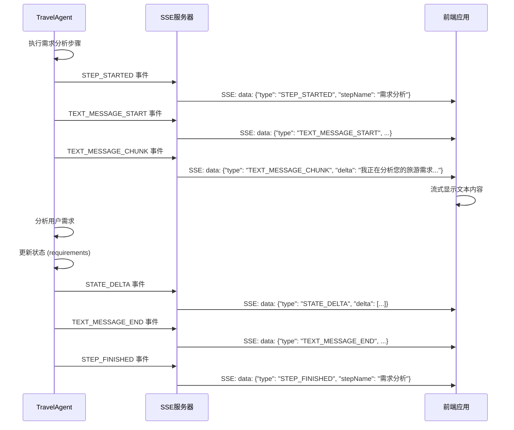

### 3. 景点查询阶段（包含工具调用）

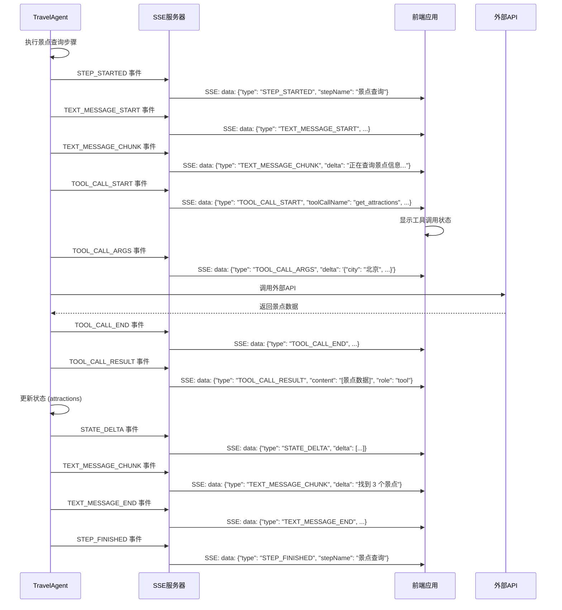

### 4. 天气查询阶段

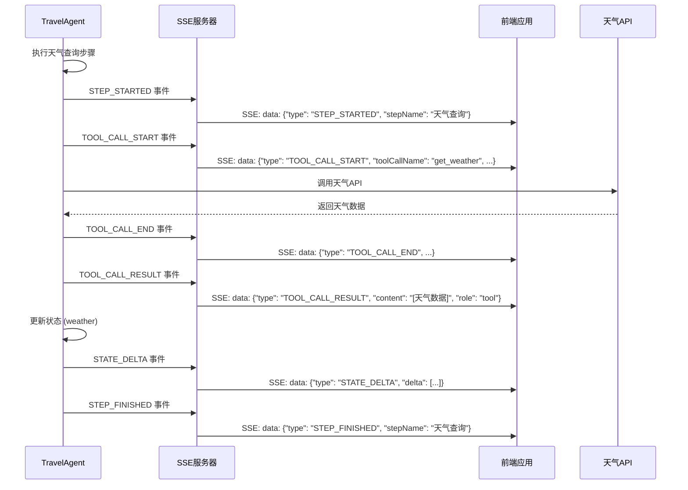

### 5. 路线规划阶段

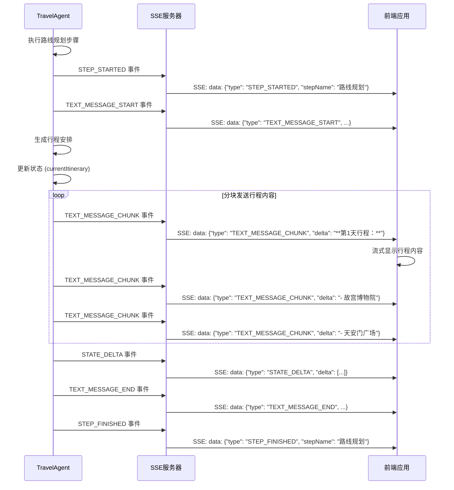

### 6. 预算计算阶段

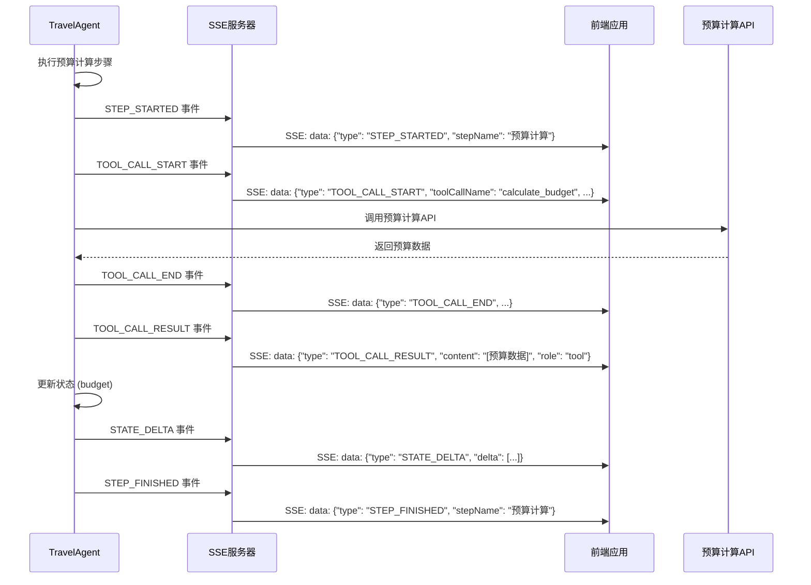

### 7. 用户交互阶段

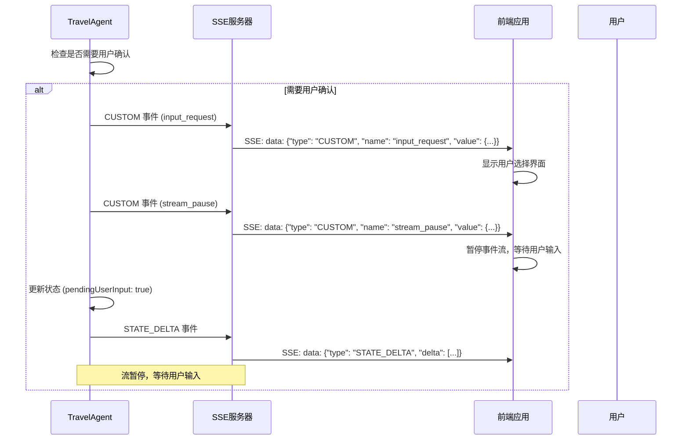

### 8. 用户输入继续处理

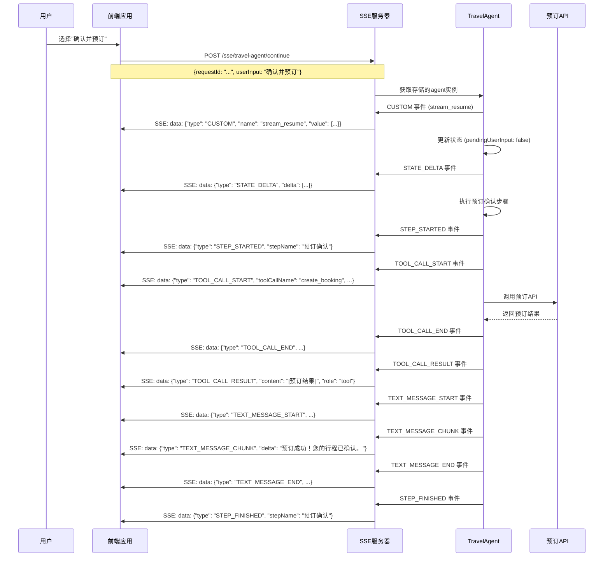

### 9. 完成阶段

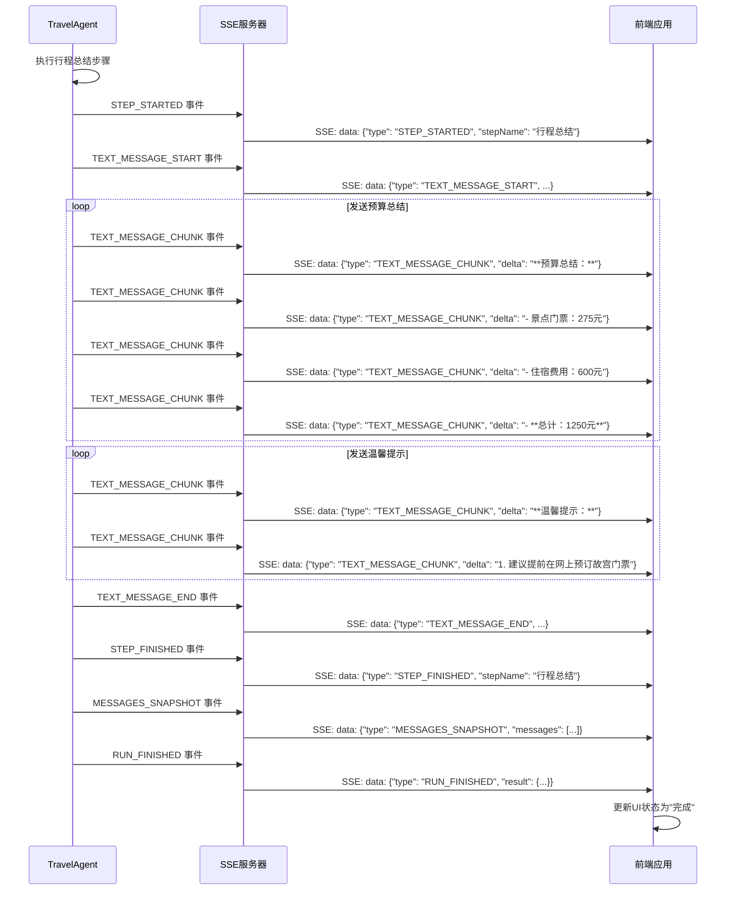

## 状态管理流程

### 状态结构

```javascript
{
  userPreferences: {},        // 用户偏好
  currentItinerary: {},       // 当前行程
  completedSteps: [],         // 已完成步骤
  currentStep: null,          // 当前步骤
  pendingUserInput: false,    // 等待用户输入
  requirements: null,         // 需求分析结果
  attractions: null,          // 景点信息
  weather: null,              // 天气信息
  budget: null,               // 预算信息
}
```

### 状态更新流程

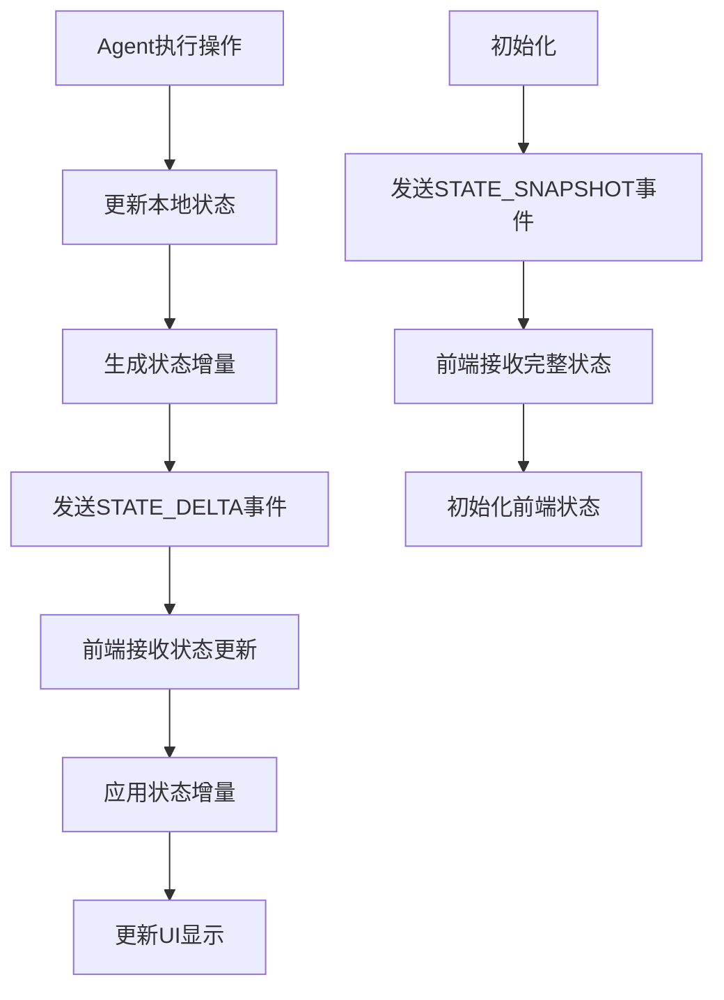

## 错误处理流程

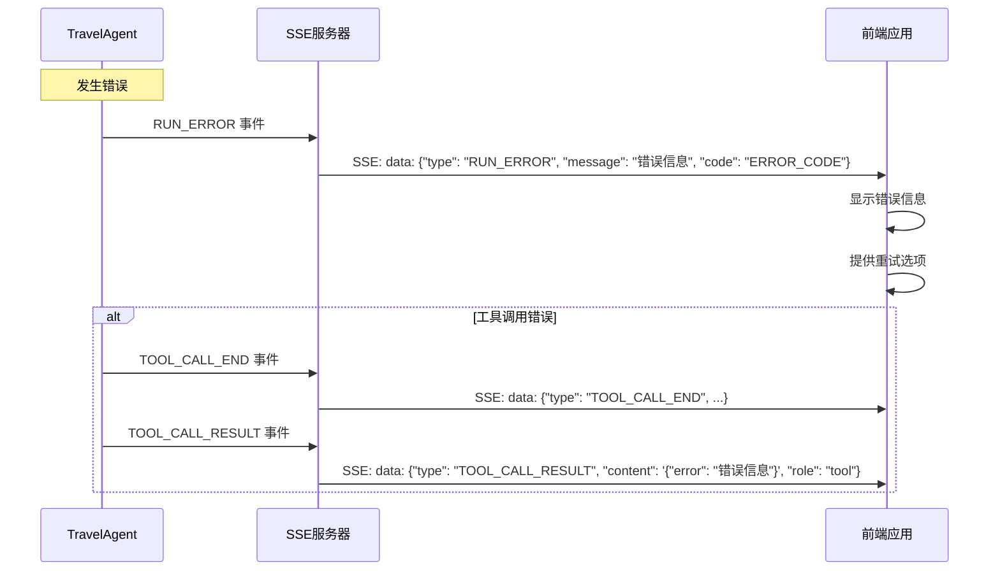

## 事件类型总结

| 事件类型 | 发送时机 | 前端处理 |
|---------|---------|---------|
| `RUN_STARTED` | Agent开始运行 | 显示加载状态 |
| `STEP_STARTED` | 每个步骤开始 | 显示步骤进度 |
| `TEXT_MESSAGE_START` | 文本消息开始 | 创建消息容器 |
| `TEXT_MESSAGE_CHUNK` | 文本内容流 | 流式显示文本 |
| `TEXT_MESSAGE_END` | 文本消息结束 | 完成消息显示 |
| `TOOL_CALL_START` | 工具调用开始 | 显示工具调用状态 |
| `TOOL_CALL_ARGS` | 工具调用参数 | 显示调用参数 |
| `TOOL_CALL_END` | 工具调用结束 | 更新工具调用状态 |
| `TOOL_CALL_RESULT` | 工具调用结果 | 显示调用结果 |
| `STEP_FINISHED` | 每个步骤完成 | 更新步骤状态 |
| `STATE_SNAPSHOT` | 状态快照 | 初始化状态 |
| `STATE_DELTA` | 状态增量更新 | 应用状态更新 |
| `MESSAGES_SNAPSHOT` | 消息快照 | 更新消息历史 |
| `CUSTOM` | 自定义事件 | 处理用户交互 |
| `RUN_FINISHED` | Agent完成运行 | 显示完成状态 |
| `RUN_ERROR` | 发生错误 | 显示错误信息 |

## 关键设计要点

1. **事件驱动架构**: 所有交互都通过标准化事件进行
2. **流式处理**: 文本和工具调用都支持流式传输
3. **状态同步**: 通过快照和增量更新保持状态一致
4. **错误恢复**: 完整的错误处理和恢复机制
5. **用户交互**: 支持暂停和继续的用户交互模式
6. **工具集成**: 标准化的工具调用和结果处理
7. **可扩展性**: 支持自定义事件和业务逻辑扩展 