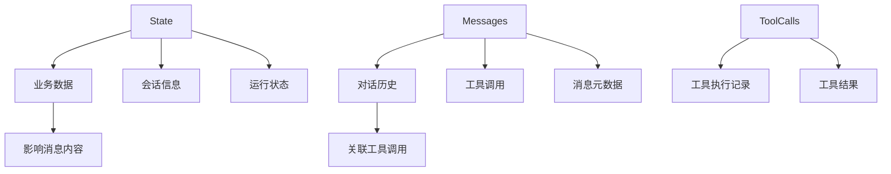

# State 和 Messages 关系说明

## 概述

在 AG-UI 前端事件处理器中，`state` 和 `messages` 是两个核心数据结构，它们有不同的职责和关系：

## 数据结构关系

### 1. State（应用状态）

**职责**: 存储业务数据和会话信息
**特点**: 
- 包含业务逻辑相关的数据
- 支持增量更新（STATE_DELTA）
- 可以序列化和持久化

```javascript
this.state = {
  // 会话信息
  runId: null,           // 当前运行ID
  threadId: null,        // 线程ID
  isRunning: false,      // 运行状态
  currentStep: null,     // 当前步骤
  
  // 业务数据
  userPreferences: {},   // 用户偏好
  currentItinerary: {},  // 当前行程
  completedSteps: [],    // 已完成步骤
  pendingUserInput: false, // 等待用户输入
  requirements: null,    // 需求分析结果
  attractions: null,     // 景点信息
  weather: null,         // 天气信息
  budget: null,          // 预算信息
  
  // 历史会话信息
  sessionHistory: [],    // 会话历史记录
  lastMessageId: null,   // 最后消息ID
};
```

### 2. Messages（消息存储）

**职责**: 存储对话消息和工具调用
**特点**:
- 存储完整的对话历史
- 支持流式更新
- 包含消息元数据和内容

```javascript
// 消息结构
{
  id: "msg_123",
  role: "assistant",     // user, assistant, tool, system
  content: "消息内容",
  timestamp: 1234567890,
  completed: true,       // 是否完成
  toolCalls: ["tool_1", "tool_2"], // 关联的工具调用ID
}

// 工具调用结构
{
  id: "tool_1",
  name: "get_attractions",
  status: "completed",   // running, completed, error
  startTime: 1234567890,
  endTime: 1234567891,
  duration: 1000,
  args: '{"city": "北京"}',
  result: '[{"name": "故宫"}]',
  resultRole: "tool",
  parentMessageId: "msg_123",
}
```

## 关系说明

### 1. 数据分离原则

- **State**: 存储"什么"（业务数据）
- **Messages**: 存储"如何"（交互过程）

### 2. 关联关系



### 3. 数据流向

```
用户输入 → State更新 → 生成消息 → Messages存储 → UI显示
     ↓
工具调用 → ToolCalls记录 → 更新State → 生成结果消息
     ↓
状态同步 → STATE_DELTA → 前端应用 → UI更新
```

## 后端接口结构

### 1. 初始化接口

**GET** `/api/session/{threadId}`

```javascript
// 响应结构
{
  "threadId": "thread_123",
  "state": {
    "userPreferences": {},
    "currentItinerary": {},
    "completedSteps": [],
    "requirements": null,
    "attractions": null,
    "weather": null,
    "budget": null,
  },
  "messages": [
    {
      "id": "msg_1",
      "role": "user",
      "content": "帮我规划北京旅游",
      "timestamp": 1234567890,
      "completed": true,
      "toolCalls": []
    },
    {
      "id": "msg_2", 
      "role": "assistant",
      "content": "正在为您规划北京旅游行程...",
      "timestamp": 1234567891,
      "completed": true,
      "toolCalls": ["tool_1"]
    }
  ],
  "toolCalls": [
    {
      "id": "tool_1",
      "name": "get_attractions",
      "status": "completed",
      "startTime": 1234567891,
      "endTime": 1234567892,
      "duration": 1000,
      "args": '{"city": "北京"}',
      "result": '[{"name": "故宫", "rating": 4.8}]',
      "resultRole": "tool",
      "parentMessageId": "msg_2"
    }
  ],
  "sessionHistory": [
    {
      "type": "session_started",
      "data": { "runId": "run_123", "threadId": "thread_123" },
      "timestamp": 1234567890
    },
    {
      "type": "message_completed",
      "data": { "messageId": "msg_1", "role": "user" },
      "timestamp": 1234567891
    }
  ]
}
```

### 2. 状态快照接口

**GET** `/api/session/{threadId}/state`

```javascript
// 响应结构
{
  "snapshot": {
    "runId": "run_123",
    "threadId": "thread_123",
    "isRunning": false,
    "currentStep": null,
    "userPreferences": {},
    "currentItinerary": {
      "day1": ["故宫", "天安门"],
      "day2": ["长城", "颐和园"]
    },
    "completedSteps": ["需求分析", "景点查询", "路线规划"],
    "pendingUserInput": false,
    "requirements": {
      "city": "北京",
      "duration": 3,
      "budget": "medium"
    },
    "attractions": [
      { "name": "故宫", "rating": 4.8, "price": 60 },
      { "name": "长城", "rating": 4.9, "price": 120 }
    ],
    "weather": {
      "day1": { "condition": "晴天", "temp": "15-25°C" },
      "day2": { "condition": "多云", "temp": "12-22°C" }
    },
    "budget": {
      "attractions": 275,
      "accommodation": 600,
      "meals": 300,
      "transportation": 75,
      "total": 1250
    }
  }
}
```

### 3. 消息历史接口

**GET** `/api/session/{threadId}/messages`

```javascript
// 响应结构
{
  "messages": [
    {
      "id": "msg_1",
      "role": "user",
      "content": "帮我规划一个3天的北京旅游行程",
      "timestamp": 1234567890,
      "completed": true,
      "toolCalls": []
    },
    {
      "id": "msg_2",
      "role": "assistant", 
      "content": "我正在分析您的旅游需求...\n\n根据您的需求，我为您规划了以下3天北京旅游行程：\n\n**第1天行程：**\n- 故宫博物院\n- 天安门广场\n- 王府井步行街\n\n**第2天行程：**\n- 八达岭长城\n- 颐和园\n- 什刹海酒吧街\n\n**第3天行程：**\n- 天坛公园\n- 南锣鼓巷\n- 后海\n\n**预算总结：**\n- 景点门票：275元\n- 住宿费用：600元\n- 餐饮费用：300元\n- 交通费用：75元\n- **总计：1250元**",
      "timestamp": 1234567891,
      "completed": true,
      "toolCalls": ["tool_1", "tool_2", "tool_3"]
    }
  ],
  "toolCalls": [
    {
      "id": "tool_1",
      "name": "get_attractions",
      "status": "completed",
      "startTime": 1234567891,
      "endTime": 1234567892,
      "duration": 1000,
      "args": '{"city": "北京", "category": "历史文化", "limit": 10}',
      "result": '[{"name": "故宫", "rating": 4.8, "price": 60}, {"name": "长城", "rating": 4.9, "price": 120}]',
      "resultRole": "tool",
      "parentMessageId": "msg_2"
    },
    {
      "id": "tool_2",
      "name": "get_weather",
      "status": "completed",
      "startTime": 1234567893,
      "endTime": 1234567894,
      "duration": 500,
      "args": '{"city": "北京", "days": 3}',
      "result": '{"day1": {"condition": "晴天", "temp": "15-25°C"}, "day2": {"condition": "多云", "temp": "12-22°C"}}',
      "resultRole": "tool",
      "parentMessageId": "msg_2"
    },
    {
      "id": "tool_3",
      "name": "calculate_budget",
      "status": "completed",
      "startTime": 1234567895,
      "endTime": 1234567896,
      "duration": 800,
      "args": '{"attractions": [...], "accommodation": "商务酒店", "duration": 3}',
      "result": '{"attractions": 275, "accommodation": 600, "meals": 300, "transportation": 75, "total": 1250}',
      "resultRole": "tool",
      "parentMessageId": "msg_2"
    }
  ]
}
```

### 4. 会话历史接口

**GET** `/api/session/{threadId}/history`

```javascript
// 响应结构
{
  "sessionHistory": [
    {
      "type": "session_started",
      "data": {
        "runId": "run_123",
        "threadId": "thread_123"
      },
      "timestamp": 1234567890
    },
    {
      "type": "step_started",
      "data": {
        "stepName": "需求分析"
      },
      "timestamp": 1234567891
    },
    {
      "type": "message_completed",
      "data": {
        "messageId": "msg_1",
        "role": "user",
        "contentLength": 15
      },
      "timestamp": 1234567892
    },
    {
      "type": "tool_call_started",
      "data": {
        "toolCallId": "tool_1",
        "toolName": "get_attractions"
      },
      "timestamp": 1234567893
    },
    {
      "type": "tool_call_completed",
      "data": {
        "toolCallId": "tool_1",
        "duration": 1000
      },
      "timestamp": 1234567894
    },
    {
      "type": "session_finished",
      "data": {
        "result": {
          "totalSteps": 5,
          "generatedItinerary": true,
          "totalCost": 1250
        }
      },
      "timestamp": 1234567895
    }
  ]
}
```

## 前端实现建议

### 1. 状态管理

```javascript
// 状态更新
handleStateDelta(event) {
  event.delta.forEach((patch) => {
    this.applyPatch(patch);
  });
  this.updateStateDisplay();
}

// 消息更新
handleTextMessageChunk(event) {
  const message = this.messages.get(event.messageId);
  if (message) {
    message.content += event.delta;
    this.updateMessageContent(event.messageId, message.content);
  }
}
```

### 2. 历史消息显示

```javascript
// 显示历史消息
displayMessageHistory() {
  const history = this.getMessageHistory();
  
  history.forEach((message) => {
    const messageDiv = this.createHistoryMessageElement(message);
    this.ui.historyContainer.appendChild(messageDiv);
  });
}

// 创建历史消息元素
createHistoryMessageElement(message) {
  const messageDiv = document.createElement('div');
  messageDiv.className = `history-message ${message.role}`;
  messageDiv.innerHTML = `
    <div class="message-header">
      <span class="message-role">${this.formatRole(message.role)}</span>
      <span class="message-time">${this.formatTime(message.timestamp)}</span>
    </div>
    <div class="message-content">${this.formatMessageContent(message.content)}</div>
    ${this.renderToolCalls(message.toolCalls)}
  `;
  return messageDiv;
}
```

### 3. 数据持久化

```javascript
// 保存会话数据
saveSessionData() {
  const sessionData = this.exportSessionData();
  localStorage.setItem(`session_${this.state.threadId}`, JSON.stringify(sessionData));
}

// 加载会话数据
loadSessionData(threadId) {
  const savedData = localStorage.getItem(`session_${threadId}`);
  if (savedData) {
    const sessionData = JSON.parse(savedData);
    this.state = sessionData.state;
    this.messages = new Map(sessionData.messages.map(msg => [msg.id, msg]));
    this.toolCalls = new Map(sessionData.toolCalls.map(tool => [tool.id, tool]));
    this.refreshMessageDisplay();
  }
}
```

## 总结

- **State**: 业务数据，支持增量更新，用于UI状态管理
- **Messages**: 对话历史，支持流式更新，用于显示交互过程
- **ToolCalls**: 工具调用记录，关联到消息，用于显示执行过程
- **SessionHistory**: 会话事件记录，用于调试和审计

这种设计实现了数据分离、状态同步和历史记录的功能，为复杂的AI Agent交互提供了完整的数据管理方案。 